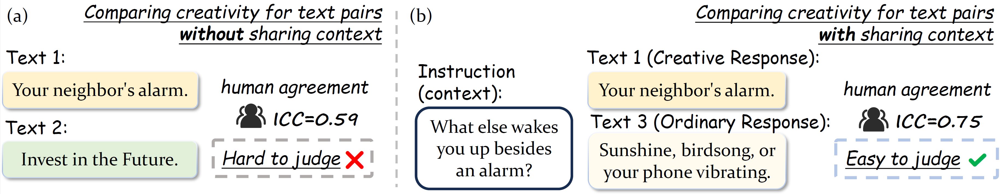
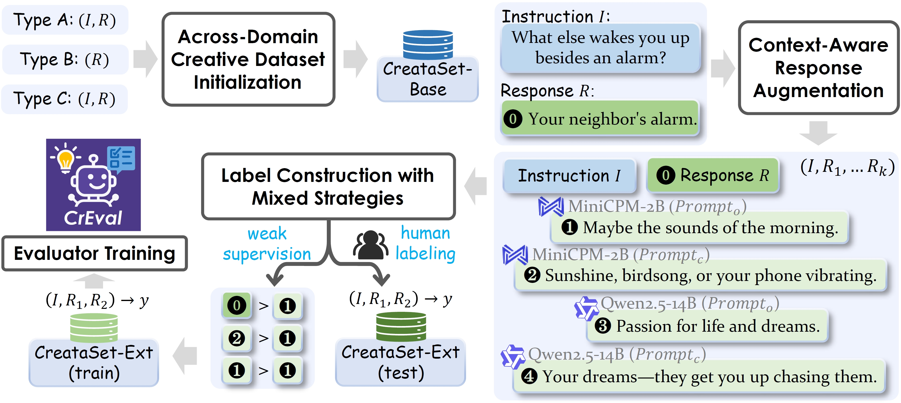

<a name="readme-top"></a>
<p align="center">
  
  <h1 align="center">Evaluating Text Creativity across Diverse Domains:</br>A Dataset and a Large Language Model Evaluator</h1>
</p>


<div align="center">
  <a href="https://creval-creative-evaluation.github.io/"></a>
  <a href="https://arxiv.org/pdf/2505.19236"></a>
  <br/>
  <a href="https://huggingface.co/datasets/Aman/CreataSet"></a>
  <a href="https://huggingface.co/Aman/CrEval-7b"></a>
  <a href="https://huggingface.co/Aman/CrEval-14b"></a>
  <a href="https://github.com/Aman-4-Real/CrEval"></a>
  <br/>
  <hr>
</div>


<span id='news'/>

## 🔥 News

<div class="scrollable">
    <ul>
      <li><strong>[2025, Sep 01]</strong>: &nbsp;🎉🎉We release the dataset <a href="https://huggingface.co/datasets/Aman/CreataSet">CreataSet</a> and out creativity evaluation model <a href="https://huggingface.co/Aman/CrEval-7b">CrEval-7b</a> & <a href="https://huggingface.co/Aman/CrEval-14b">CrEval-14b</a>. Feel free to use!</li>
      <li><strong>[2025, May 25]</strong>: &nbsp;🎉🎉Our <a href="https://arxiv.org/pdf/2505.19236">arXiv paper</a> is available! Check it out for more details.</li>
    </ul>
</div>
<span id='table-of-contents'/>

## 📑 Table of Contents

* <a href='#news'>🔥 News</a>
* <a href='#brief_intro'>📍 Brief Intro</a>
* <a href='#usage'>⚡ Usage</a>
  * <a href='#setup'>Setup</a>
  * <a href='#infer'>Inference</a>
* <a href='#cite'>🌟 Cite</a>


<span id='brief_intro'/>

## 📍 Brief Intro

We introduce **CrEval**, the 1st LLM-based evaluator for pairwise creativity evaluation, outperforming GPT-4o by 18.7% in human agreement, and **CreataSet**, a large-scale dataset of over **1M** creative instruction-response pairs across **87** domains. CrEval is a creativity evaluation model based on a pairwise comparison protocol, designed to advance automated evaluation of text creativity. CreataSet can facilitate the meta-evaluation of pairwise comparison models for assessing text creativity. Also, it can be used for training creative generation models. More details please refer to our [paper](https://arxiv.org/abs/2505.19236). 

<details>
<summary> Abstract (Click me) </summary>

Creativity evaluation remains a challenging frontier for large language models (LLMs). Current evaluations heavily rely on inefficient and costly human judgments, hindering progress in enhancing machine creativity. While automated methods exist, ranging from psychological testing to heuristic- or prompting-based approaches, they often lack generalizability or alignment with human judgment.

To address these issues, in this paper, we propose a novel pairwise-comparison framework for assessing textual creativity, leveraging shared contextual instructions to improve evaluation consistency. We introduce CreataSet, a large-scale dataset with 100K+ human-level and 1M+ synthetic creative instruction-response pairs spanning diverse open-domain tasks. Through training on CreataSet, we develop an LLM-based evaluator named CrEval. CrEval demonstrates remarkable superiority over existing methods in alignment with human judgments.

Experimental results underscore the indispensable significance of integrating both human-generated and synthetic data in training highly robust evaluators, and showcase the practical utility of CrEval in boosting the creativity of LLMs. We will release all data, code, and models publicly soon to support further research.
</details>


<p align="center">
  <br/>
  Figure 1. An example of how to formulate the problem of text creativity evaluation to evaluate better.
</p>
<p align="center">
  <br/>
  Figure 2. The construction process of CreataSet and training process of CrEval.
</p>


<span id='usage'/>

## ⚡ Usage

<span id='setup'/>

### Setup

Create a new virtual environment:
```
git clone https://github.com/Aman-4-Real/CrEval.git
cd CrEval/
conda create -n creval python=3.10
conda activate creval
```
Our code is based on [LLaMA-Factory](https://github.com/hiyouga/LLaMA-Factory). Thanks for their great work!
Using the it by installing the version `llamafactory=0.9.2.dev0` and the corresponding Python packages.
Change the cudatoolkit version according to your environment if necessary.
We also provide a `requirements.txt` which you can refer to.
```
pip install -r requirements.txt
```


<span id='infer'/>

### Inference

You can use our CrEval model via the inference methods provided by LlamaFactory.

After downloading the ckpt <a href="https://huggingface.co/Aman/CrEval-7b">CrEval-7b</a> or <a href="https://huggingface.co/Aman/CrEval-14b">CrEval-14b</a> , start the API server using the provided configuration file [creval_api.yaml](https://github.com/Aman-4-Real/CrEval/blob/main/creval_api.yaml). Make sure to update the `YOUR_PATH` fields in the config as needed:

```
API_PORT=8000 CUDA_VISIBLE_DEVICES=0 llamafactory-cli api creval_api.yaml
```

Run an interactive test using the script [inference.py](https://github.com/Aman-4-Real/CrEval/blob/main/inference.py):

```
python inference.py
```
> Once the server is running, the script will allow you to interactively test the CrEval model in your CLI.


<hr>

> *We respect and uphold the usage terms of the original data providers. If you believe that any part of this dataset affects your legal rights or raises other concerns, please reach out to us. We will carefully review your request and respond without delay.*


<span id='cite'/>

## 🌟 Cite

<h2> Please cite our paper if you find our work useful. </h2>

```
@article{cao2025evaluating,
  title={Evaluating Text Creativity across Diverse Domains: A Dataset and Large Language Model Evaluator},
  author={Cao, Qian and Wang, Xiting and Yuan, Yuzhuo and Liu, Yahui and Luo, Fang and Song, Ruihua},
  journal={arXiv preprint arXiv:2505.19236},
  year={2025}
}
```
For any questions, please feel free to reach me at caoqian4real@ruc.edu.cn.


